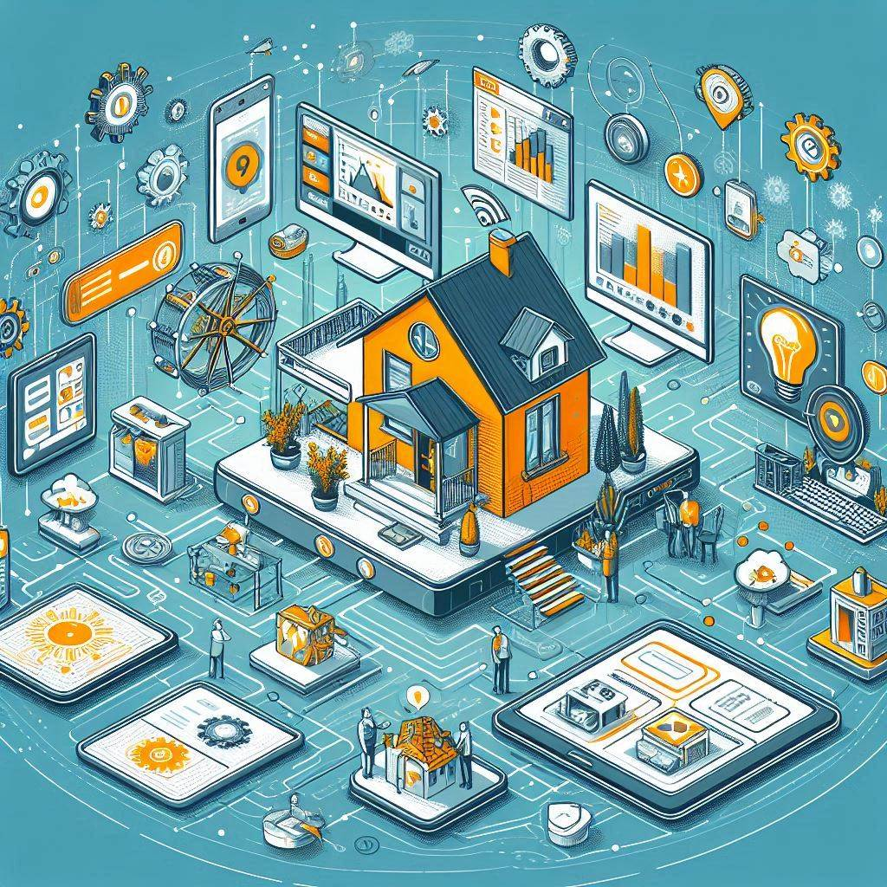

# 🏠 Smart Home Technologies



**Ваш умный дом и магазин будущего**  
*Объединяем управление умным домом и продажу устройств в одной экосистеме*

---

## 🚀 О проекте

**Smart Home Technologies** — это масштабируемая микросервисная платформа с:
- 📲 Интуитивным управлением умным домом
- 🛒 Встроенным интернет-магазином устройств
- ⚙️ Автоматизацией сценариев домашней техники

### Архитектура
| Модуль         | Описание                          |
|----------------|-----------------------------------|
| **`infra`**    | Центр управления сервисами (Spring Cloud) |
| **`telemetry`**| Автоматизация сценариев умного дома |
| **`commerce`** | Интернет-магазин устройств         |

---

## 🛠 Технологии

**Ядро системы:**
- 🐳 Docker • Docker Compose
- 🌐 Apache Kafka (межсервисная коммуникация)
- ⚡ gRPC + Protobuf (высокопроизводительный RPC)
- ☁️ Spring Cloud (микросервисы)
- 🗄 PostgreSQL (основное хранилище)

---

## 🚀 Быстрый старт

### Предварительные требования
- Установленные:
  - Docker + Docker Compose
  - JDK 21
  - Maven

### Запуск системы
1. Сборка проекта:
```bash
mvn clean install
```

2. Запуск инфраструктуры:
```bash
docker-compose up -d
```

3. Сервисы будут доступны:
- API Gateway: `http://localhost:8080`
- Документация API: [specifical.json](/specifical.json)

---

## 🌟 Почему мы?

- ✅ **Готовая к масштабированию** микросервисная архитектура
- 🔄 Реальное время: Kafka для мгновенных событий
- 🛡 Отказоустойчивость через Spring Cloud
- 📦 Все компоненты в Docker-контейнерах

---
